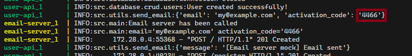

# user-registration-api

Goal is to register an user and send them an email with the auth code to validate the registration.

# Architecture


# Structure of the repository

- `docs/` contains the architecture schema.
- `email_server_mock/` contains the mock of the email server.
- `src/` contains the code for the user-api
- `test/` contains all the unit tests.

# ROADMAP

- [x] Structure of the repo
- [x] [C4 schema](https://c4model.com/) of the solution.
- [x] Docker deployment
- [x] docker-compose deployment with DB
- [x] Setup the db
- [x] User registration logic
  - [x] Create user
  - [x] Send email to user containing the code
- [x] docker-compose deployment with DB and mocked email server
- [x] Email sender
- [x] Validate activation code
- [x] Pretify code
- [x] Add more doc in README
- [x] Unvalidate the `activate` call if the call comes more than 1min after the `register` call

# Run it

```
docker-compose up -d
```

Go to `http://localhost:8000/docs` to see the docs of the API

The flow works like this:

1. User registers by calling `/register` API with `email` and `password` in the body of the request.
2. We store the details in our db.
3. We send an email to the user using the `email_server_mock`. In this example, since the email is not sent, check for the log of email server.
   

The code in this example is `4466`

4. Call `/activate` using previous email and password `BASIC AUTH`. As body, give the `activation_code` retrieved in the previous step. Hurry up! You will have only 1 min to use this code.
5. 2 possibilities:

   a. If it is used in less than 1 min --> Success! Your user has been activated.

   b. If it is used after 1 min --> Failure! The code has expired.

# Run it in local

Same as above but building the source code every time

```
docker-compose up --build
```

# Run the tests

```
# Install general dependencies
pip install -r requirements.txt

# To install pytest + test dependencies
pip install -r requirements.test.txt

# Run the tests
TEST_MODE=true python3 -m pytest
```

Run tests with debug logging

```
TEST_MODE=true python3 -m pytest --log-cli-level=DEBUG -rP
```

Run the tests to see the coverage

```
TEST_MODE=true python3 -m pytest --cov
```
